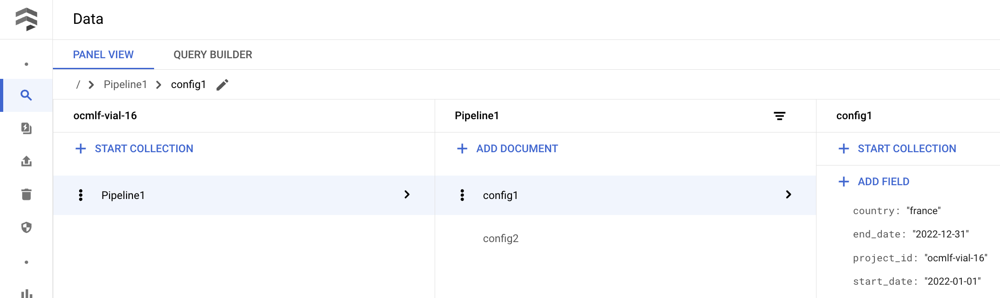

It is a very good practice to make your pipelines parameterizable. That means replacing all hardcoded values by variables that you are going to pass to the pipeline and eventually to the components.

Pipeline parameters can be:

- Model training parameters
- Start date and end date of the data you want to work with
- Product categories
- Geography (country, region, stores, ...)
- Customer segments
- ...

Leveraging parametrized pipelines will allow you to run the same pipeline with different parameter sets. This is much more practical to deploy and maintain compared to pipelines with slightly different hardcoded values.

## Passing config values to the pipeline

### Basic pipeline parametrization
In most cases, just passing values to your pipeline as parameters is the simplest and best way to go.

````python3
import os

import kfp
from kfp.v2 import compiler
import google.cloud.aiplatform as aip
from kfp.v2.dsl import component


@component(base_image=f'eu.gcr.io/{os.getenv("PROJECT_ID")}/vertex-pipelines-base:latest')
def dummy_task(project_id: str, country: str, start_date: str, end_date: str):
    pass


# This part defines the pipeline and its parameters
@kfp.dsl.pipeline(name="parametrized-pipeline")
def pipeline(project_id: str, country: str, start_date: str, end_date: str):
    dummy_task(
        project_id=project_id,
        country=country,
        start_date=start_date,
        end_date=end_date
    )


# This part compiles the pipeline and runs it
if __name__ == '__main__':
    PROJECT_ID = os.getenv("PROJECT_ID")
    PIPELINE_NAME = "parametrized-pipeline"
    BUCKET_NAME = f"gs://<BUCKET_NAME>"
    SERVICE_ACCOUNT = f"<SA_NAME>@{PROJECT_ID}.iam.gserviceaccount.com"
    
    compiler.Compiler().compile(pipeline_func=pipeline, package_path="./pipeline.json")
    aip.init(project=PROJECT_ID, staging_bucket=BUCKET_NAME)

    job = aip.PipelineJob(
        display_name=PIPELINE_NAME,
        template_path="pipeline.json".replace(" ", "_"),
        pipeline_root=f"{BUCKET_NAME}/root",
        location="europe-west1",
        enable_caching=False,
        
        # Parameters values are passed from here to the pipeline
        parameter_values={
            "project_id": PROJECT_ID,
            "country": "france",
            "start_date": "2022-01-01",
            "end_date": "2022-12-31"
        },
    )

    job.run(service_account=SERVICE_ACCOUNT)
````

The parameters will be clearly displayed in the UI:


### Dynamically loading pipeline parameters

!!! warning "Dynamically loading a config in the pipeline"

    Pipeline parameters values are rendered when passed to components. That means you can not easily pass a configuration name and load it in the pipeline body itself.
    
    ````python3
    @kfp.dsl.pipeline(name="parametrized-pipeline")
    def pipeline(config_name: str):
        print(config_name)  # Result: {{pipelineparam:op=;name=config_name}} -> not rendered
    ````

    You would need a dedicated component to load your configuration and then output the values to downstream tasks. This is very complex for no benefits and probably not worth it.

!!! example "Instead, load the values before compiling the pipeline"

    ````python3
    job = aip.PipelineJob(
        display_name=PIPELINE_NAME,
        template_path="pipeline.json".replace(" ", "_"),
        pipeline_root=f"{BUCKET_NAME}/root",
        location="europe-west1",
        enable_caching=False,

        parameter_values=load_config("config_1"),
    )
    ````

    ??? info "`load_config` function"

        This function loads configuration values from a file as a `dict`.
        ````python3
        def load_config(config_name: str) -> Dict:
            with open(Path(__file__).parent.parent / "configs" / f"{config_name}.json") as f:
                config = json.load(f)
            return config
        ````

    ??? info "`config_1.json`"
        
        This file contains the configuration we want to load.
        ````json
        {
          "project_id": "ocmlf-vial-16",
          "country": "france",
          "start_date": "2022-01-01",
          "end_date": "2022-12-31"
        }
        ````

## Storing configs

As your project grows in scale, you will want a way to cleanly store your pipeline configurations. Here are a few suggestions for this

### Locally, in a markup language (json, yaml, toml, etc)

Storing configurations this way is simple and works well. Write one configuration per file. Then you can easily load the right one as a python dict and pass it to your pipeline.


### Locally, in python files

You can also centralize your parameters in python files and import them to your pipeline. The issue with that approach is you are going to need to store all your configs in the same file, which can get messy. 

If you want to split the configs, you will either need to: 

- Manually import them all in your pipeline file. This creates a tight coupling between your config files and your pipelines, which is undesirable.
- Dynamically import them. This is complex, and you do not get autocompletion anymore.

Basically, this is only a good option when you know you will never have a lot of different configs. And even then the benefits are fairly small.

### Remotely

If you need your configs to be centrally available on GCP you may want to store them remotely in a database. 

This can be useful when you need these configurations available elsewhere on GCP and not just in your pipeline. 

It is also practical if your configurations are not defined in the same codebase as your pipelines. For example, if you let users pilot pipelines via a Google sheet or a Streamlit, etc...

In this case, using Firestore is a very good option. It requires very little setup, and is very easy to use since it stores data as documents (essentially dicts). You will also be able to go and view your stored configurations and their contents in the UI.

??? example "Firestore usage examples"
    !!! example "Interacting with Firestore"

        ````python3
        from typing import Dict, Any, Union
        
        from google.cloud import firestore
        
        
        def set(collection: str, document_name: str, document_as_dict: Dict[str, Any]) -> None:
            client = firestore.Client()
            client.collection(collection).document(document_name).set(document_as_dict)
        

        def get(collection: str, document: str) -> Union[Dict[str, Any], None]:
            client = firestore.Client()
            doc_ref = client.collection(collection).document(document)
            doc = doc_ref.get().to_dict()  # type: Union[Dict[str, Any], None]
            return doc
        

        if __name__ == '__main__':
            # Add a config in Firestore
            set(
                collection="Pipeline1",
                document_name="config2",
                document_as_dict={
                    "project_id": "ocmlf-vial-16",
                    "country": "france",
                    "start_date": "2022-01-01",
                    "end_date": "2022-12-31"
                }
            )
            
            # Fetch a config from Firestore
            conf = get("Pipeline1", "config1")
            print(conf)  # {'end_date': '2022-12-31', 'country': 'france', 'project_id': 'ocmlf-vial-16', 'start_date': '2022-01-01'}
        ````

    

You can also store configurations as files on a bucket, but that is slightly less practical.