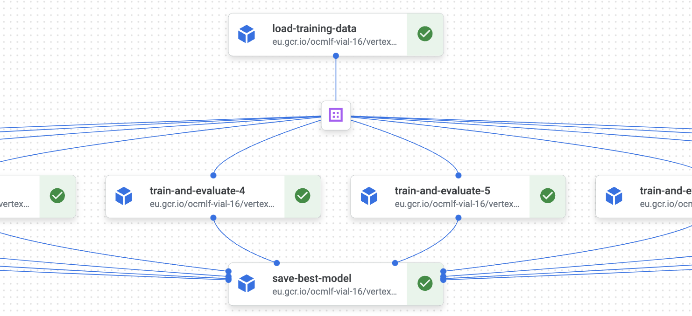

It can be difficult to decide how to split your pipeline into components. Overall, components should aim to be a self-contained business logic unit with minimal inputs and outputs.

Note that for the purpose of showing how to pass data from component to component, the components in `vertex/pipelines/my_first_pipeline.py` are very small components. 
In practice for such a simple pipeline, a single component pipeline would be better. 

## When to split a component
Having a big monolithic pipeline made of one component is obviously not ideal. 

**To iterate faster:** if you find yourself waiting for a lot of code to execute before the execution flow gets to your actual changes, then it's probably a good reason to split your component. For example, if you changed some model training parameters and need to wait for a data preprocessing step for 10 minutes before your model is retrained, split the two steps and save the training dataset as an artifact.

**To leverage orchestration:** parallelization can be achieved fairly easily in pipelines. If some processing is easily splittable, don't hesitate to use this at your advantage for a faster pipeline. If you are trying to find the right hyper-parameters for a training, you could have one component by hyper-parameter set:

!!! example "Splitting a grid search between components"

    ````python3
    @kfp.dsl.pipeline(name="find-best-hyper-parameters")
    def pipeline(project_id: str, input_table: str):
        load_data_task = load_training_data(project_id=project_id, gcp_region="europe-west1", input_table=input_table)
    
        hyper_parameters_to_test = range(10)
        grid_search_results = []
        for hyper_parameter in hyper_parameters_to_test:
            result = train_and_evaluate(hyper_parameter, load_data_task.outputs["training_data"])
            grid_search_results.append(str(result.outputs["result"]))
    
        save_best_model(grid_search_results)
    ````

    In the UI:
    


## When to merge two components
On the other end, it is not ideal either to have micro-components that barely do anything. You are going to encounter performance issues in your pipeline due to the overhead for component initialization, as well as having to manage a lot of tedious artifact management to pass data around your pipeline.

If you find yourself making changes on 4+ components to add a feature, you should probably merge some of them.
